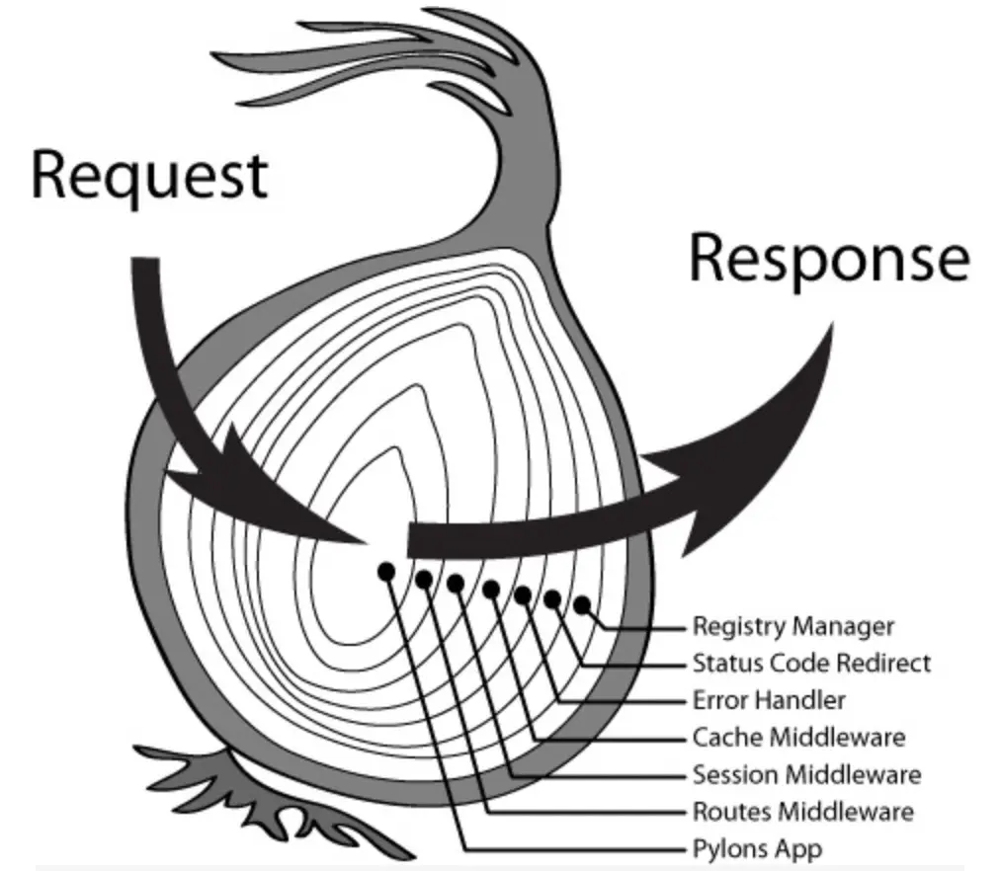

# 框架设计 <Badge type="tip" text="概念介绍" />

我们采用了洋葱模式来设计框架，[此处跳转](#模型图)

## 仿真体验

我们假设每个中间件的实现均为:

```ts
async function handler(ctx, next) {
    console.log('[MIDDLEWARE_NAME]request before')
    await next()
    console.log('[MIDDLEWARE_NAME]request after')
}
```

<FrameworkExperience />

<script setup>
import FrameworkExperience from '../.vitepress/components/FrameworkExperience.vue'
</script>

## 设计过程

- **与服务端对比**

|    端   | 语言 | 特点 |
|:------------:|:-----------:|:---:|
|     前端    |   JS(TS)/Node  | 偏灵活，动态 |
|     后端    |    Go/Java   | 偏稳固，静态 |

- **Register**

在注册能力上，后端选择在服务启动时一次性初始化所有插件/中间件，
我们选择保留前端业务灵活、语言动态的特点

<strong>因此我们有两个允许：</strong>

1. 允许用户在发起请求时，携带该次请求所需要的临时中间件
2. 允许中间件内部依赖按需加载

例如：

1. 可以在需要进行风控验证的接口请求时携带风控验证中间件
2. 风控验证中间件所依赖的验证SDK可以先不进行初始化，实际触发时再去加载执行

除了以上，我们也要遵守几个原则：

1. 对一个模块下的公共能力尽量进行最大范围的全局初始化
2. 每个实例要有明显的使用划分，避免混用，有条件的全局使用一个实例（也取决于前端应用的场景，请灵活决策）

## 模型图

### HTTP Service 的洋葱模型



### KOA 的洋葱模型


